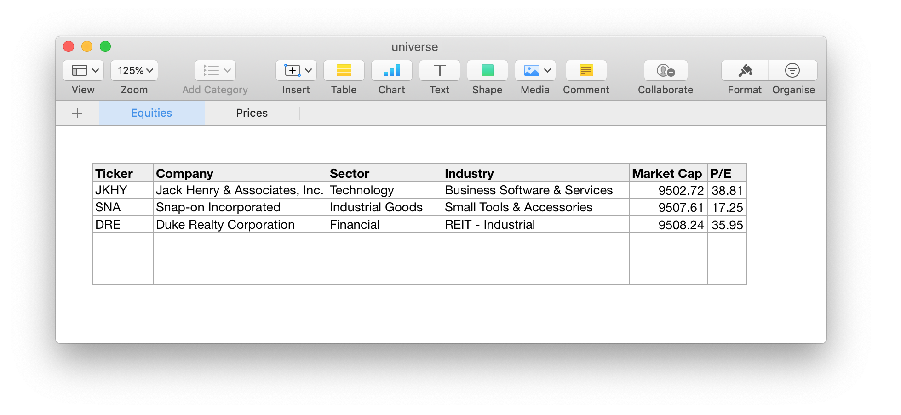

# Equities


`equities` can help individuals to maintain one or more "equity universes" in
a simple and convenient way using a bit of Python. The goal of this package is to hit a sweet spot of quick productivity with little time investment.



## Benefits

* Easy creation and maintenance of one or more equity/investment universes.
* Programmatic access to what would have otherwise been a flat file of
  some sort.
* Quick updates of price data with plug-in functions.

## Usage

```python
>>> import equities

# Create a universe. You can pass in a universe file saved previously or
# you can leave it out for an in-memory universe.
>>> universe = equities.Universe()

# You can populate your universe by importing a CSV, XLS/XLSX, or JSON file.
# Below imagine that the file 'stocks.csv' has the following content:
# Ticker,Company,Sector,Industry,Market Cap,P/E
# JKHY,"Jack Henry & Associates, Inc.",Technology,Business Software & Services,9502.72,38.81
# SNA,Snap-on Incorporated,Industrial Goods,Small Tools & Accessories,9507.61,17.25
# DRE,Duke Realty Corporation,Financial,REIT - Industrial,9508.24,35.95
>>> universe.import_file('stocks.csv')

# See all the columns in your universe.
>>> universe.columns
# => ['Ticker', 'Company', 'Sector', 'Industry', 'Market Cap', 'P/E']

# See all the tickers in your universe.
>>> universe.tickers
# => ['JKHY', 'SNA', 'DRE']

# Find out the number of equities in your universe.
>>> len(universe)
# => 3

# Retrieve information about an equity (identified by its ticker).
>>> universe.equity('SNA')
# => {'Ticker': 'SNA', 'Company': 'Snap-on Incorporated',
#     'Sector': 'Industrial Goods', 'Industry': 'Small Tools & Accessories',
#     'Market Cap': 9507.61, 'P/E': 17.25}

# Fetch prices for the equities in our universe.
>>> universe.fetch_prices()

# Check prices for SNA.
>>> universe.prices['SNA']
# Returns a pandas.Series
#               SNA
# date              
# ...
# 2018-02-05  164.29
# 2018-02-06  167.07
# 2018-02-07  166.63

# When finished, you can save the changes.
# universe.save('universe.xlsx')
```

## Design Notes

A universe is a composite object with two core components, a `tablib.Dataset`
object for `universe.equities` and a `pandas.DataFrame` for `universe.prices`.
It stores itself as an XLSX file with two sheets, the first one contains the
universe equities, and the second one the prices. Internally the universe
object handles this XLSX file as a `tablib.Databook` object. You can access
these directly, but a few convenience methods/properties are offered as well.

Key to the convenience methods is the 'ticker' or 'Ticker' column, which is
treated as a unique id for each equity (you can also set this special
column to anything you wish at the time of importing a file). The convenience
properties are:

  * `universe.tickers` and
  * `universe.columns`, which list all the universe tickers and data columns
  respectively.

You can find out the number of equities in a universe by calling
`len(universe)`. The convenience method to retrieve equity data using
its ticker is `universe.equity(<ticker>)`, it returns a dict with all columns
for the equity identified by the given ticker symbol.

## Installation

Inside the project directory run:

```bash
$ pip install .
```
Python >= 3.6 is supported.

## License

`equities` is released under the [MIT License](License).